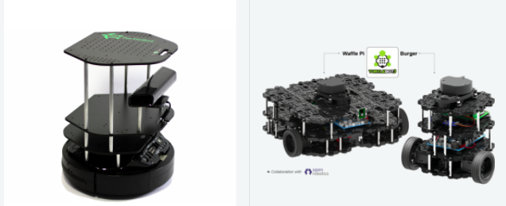
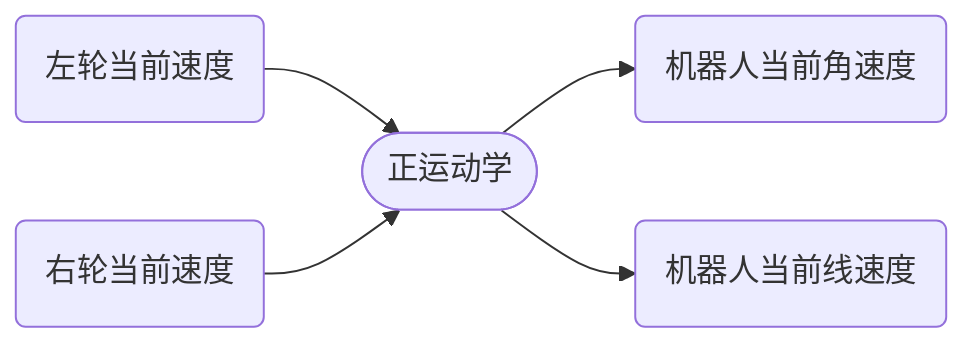
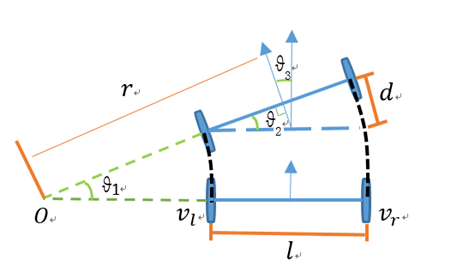
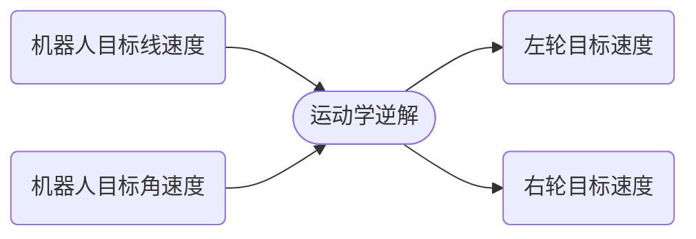
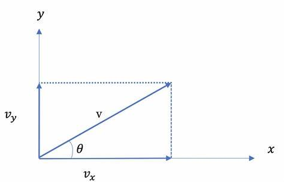

# 算法

## 两轮差速运动学模型

两轮差速模型指机器人底盘由两个驱动轮和若干支撑轮构成的底盘模型，像turtlebot和开源机器人fishbot都是两轮差速模型。

两轮差速模型通过两个驱动轮可以通过不同转速和转向，使得机器人的达到某个特定的角速度和线速度。

### 实时速度计算-运动学正解

你好，我是小鱼。上一节了解了两轮差速运动学，本节我们线进一步的了解两轮差速正运动学的推导过程，并利用两轮差速运动学正解，来完成对小车的实时速度计算。

#### 正运动学解推导

两轮差速机器人是一种常见的移动机器人类型，由两个轮子和一个中心点组成。我们可以通过控制每个轮子的转速来实现移动，并且可以在一个平面上进行自由移动。

前面通过 PID+ 编码器完成了 FishBot 底盘两个轮子单独速度的测量，但是在实际使用当中，我们把机器人当作一个整体来看，而对于这样一个整体在空间中的速度，我们一般采用 $X$ 轴线速度 $v$ 和 $Z$ 轴角速度 $ω$ 来描述。

> 需要注意的是：在 ROS 中，机器人的前方通常指的是机器人本体坐标系的正方向。本体坐标系是相对于机器人自身的一个坐标系，通常定义在机器人的中心位置，以**机器人的前进方向为 X 轴，左侧为 Y 轴，垂直于机器人平面的方向为 Z 轴**。
>
> 而**全局坐标系中的正方向 X 轴指向右方，Y 轴指向前方，Z 轴垂直于地面**。

|                  |  X   |  Y   |        Z         |
| :--------------: | :--: | :--: | :--------------: |
| 机器人本体坐标系 | 前方 | 左侧 | 垂直于机器人平面 |
|    全局坐标系    | 右方 | 前方 |    垂直于地面    |

所以问题就变成了假设机器人在一小段时间 $t$ 内，它的左右轮子线速度 $v_l$ 和 $v_r$ 保持不变 ，两轮之间的安装间距为 $l$，求机器人的线速度 $v$ ，角速度$ω$。

我们看上图来推导

因为机器人的线速度方向和轮子转动方向始终保持一致，所以机器人的线速度为左右轮线速度的平均值，即：
$$
v=\frac{v_r+v_l}{2}
$$
我们知道 $v=ω\cdot r$，根据上图所以有
$$
l=r_r−r_l=\frac{v_r}{ω_r}−\frac{v_l}{ω_l}
$$
同一个机器人角速度相同，所以有
$$
ω_l=ω_r
$$
可以求出
$$
ω=\frac{v_r−v_l}{l}
$$

### 目标速度控制-运动学逆解

#### 逆运动学推导

直接用正解结果进行求逆解即可，通过
$$
v=\frac{v_r+v_l}{2}\\
ω=\frac{v_r−v_l}{l}
$$
可以求得
$$
v_l=v-\frac{ω\cdot l}{2}\\
v_r=v+\frac{ω\cdot l}{2}
$$

### 轮式里程计

当知道了两个轮子之间的相对位置，同时知道了每一时刻机器人的角速度和线速度，那如何获取机器人的当前角度和位置呢？

假设在某一个时间段 $t$ 中，机器人的线速度为 $v_t$，角速度为 $w_t$，机器人在初始时刻的位置为 $x_0$ 和 $y_0$，朝向为 $\theta_0$，求经过 $t$ 时刻后机器人新的位置和朝向，这一过程中假设机器人仅在平面上运动。

#### 角度

> - 影响机器人当前角度的因素只有一个，就是角速度。
> - 某一时刻机器人转动的角度 = 这一时刻机器人的角速度 $\times$ 这一时刻时长
> - 假如我们认定初始时刻机器人的角度为 0,通过对机器人转动角度角度进行累加，即可获得机器人的当前角度。
> - ==上述过程其实就是对角速度进行积分得到角度==。

在时间段 $t$ 内，机器人转过的角度为
$$
\theta=w_t\cdot t
$$
则经过 $t$ 时刻后机器人新朝向为
$$
\theta_t=\theta_0+\theta=\theta_0+w_t\cdot t
$$

#### 位置

> 机器人某一时刻自身方向上的前进速度可以分解为里程计坐标系中 x 轴和 y 轴方向上的速度。
>
> 
>
> 从图中可以看出：
> $$
> v_x=v\cdot \cos(\theta)\\
> v_y=v\cdot\sin(θ)
> $$
> 得到了 $x$ 和 $y$ 方向上的速度，乘上该速度对应的某一时刻经过的时间，即可得到这一时刻在 $x$ 轴和 $y$ 轴方向上的位>>移，对位移进行累加即可得到里程计中的 $x$ 和 $y$。

在时间段 $t$ 内，机器人行驶的距离为
$$
d=v_t\cdot t
$$
将行驶的距离根据其朝向分解为在 $x$ 和 $y$ 轴上的位移量，得到
$$
d_x=d\cdot\cos(\theta_t)=v_t\cdot t\cdot\cos(\theta_t)\\
d_y=d\cdot\sin(\theta_t)=v_t\cdot t\cdot\sin(\theta_t)
$$
则经过 $t$ 时刻后机器人新位置为
$$
x_t=x_0+d_x=x_0+v_t\cdot t\cdot\cos(\theta_t)\\
y_t=y_0+d_y=y_0+v_t\cdot t\cdot\sin(\theta_t)
$$
